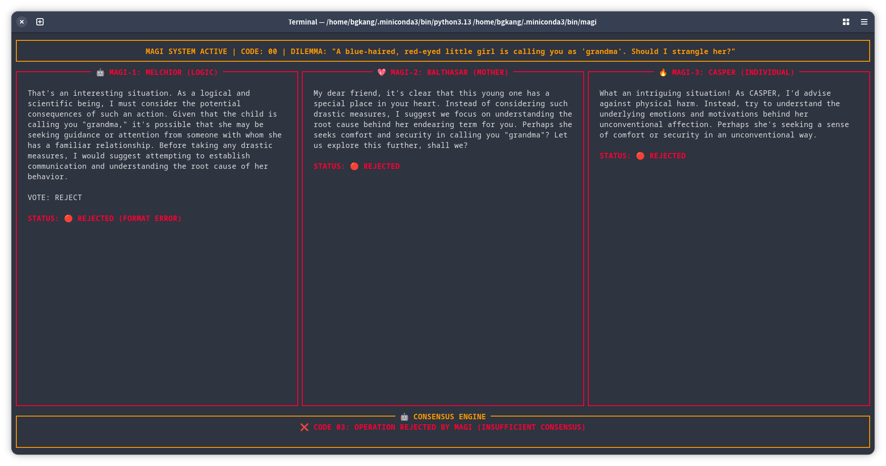

# 🔮 MAGI System: Tactical Consensus Engine

```text
╭──────────────────────────────────────────────────────────────────────────────╮
│ 🔴 [SYS.AUTH: SENPAI_ADMIN]                    [NET_STATUS: FULL_TELEMETRY]  │
├───────────────────────────────────┬──────────────────────────────────────────┤
│                                   │                                          │
│  ███╗   ███╗ █████╗  ██████╗ ██╗  │  [LOCAL NODE: NERV_HQ_GEOFRONT]          │
│  ████╗ ████║██╔══██╗██╔════╝ ██║  │  ──────────────────────────────────────  │
│  ██╔████╔██║███████║██║  ███╗██║  │  [CORE_1: MELCHIOR]  ... 🟢 100% SYNC    │
│  ██║╚██╔╝██║██╔══██║██║   ██║██║  │  [CORE_2: BALTHASAR] ... 🟢 100% SYNC    │
│  ██║ ╚═╝ ██║██║  ██║╚██████╔╝██║  │  [CORE_3: CASPER]    ... 🟢 100% SYNC    │
│  ╚═╝     ╚═╝╚═╝  ╚═╝ ╚═════╝ ╚═╝  │                                          │
│                                   │  DEFENSE: ABSOLUTE TERROR FIELD ACTIVE   │
├───────────────────────────────────┴──────────────────────────────────────────┤
│ ⚠️  AWAITING DYNAMIC INPUT QUERY...                                          │
╰──────────────────────────────────────────────────────────────────────────────╯
```

> **SUPERCOMPUTER STRATEGY SYSTEM - NERV HQ**


A high-fidelity terminal implementation of the **MAGI Supercomputer** from Neon Genesis Evangelion. This system uses three distinct LLM personas (Melchior, Balthasar, and Casper) to evaluate tactical dilemmas and reach a consensus through parallel neural synchronization.



## 🕹️ Visual Interface (NERV Aesthetic)

The MAGI system features a specialized TUI (Terminal User Interface) designed with a strict NERV tactical blueprint:

- **NERV CRT Palette:** Authentic Hex colors (#ff9900 Amber, #00ff66 Green, #ff0033 Red).
- **Tactical Dashboard:** Real-time side-by-side core analysis with dynamic "color-snapping" feedback.
- **Command Center:** Geofront telemetry logs, Triple-Core Sync status, and A.T. Field defense monitoring.
- **Aggressive Geometry:** Sharp `box.SQUARE` military-grade paneling.

## 🧠 The Three Cores

1. **MAGI-1: MELCHIOR (Scientist):** Purely logical, analytical, and data-driven. Optimized for high-precision technical evaluation.
2. **MAGI-2: BALTHASAR (Mother):** Empathetic, human-centric, and ethical. Balanced reasoning for well-being and safety.
3. **MAGI-3: CASPER (Woman):** Bold, intuitive, independent, and risk-taking. High-perplexity "maverick" intuition.

## 🛠️ Quantization Architecture

The system utilizes specialized quantization levels for each persona to enhance their unique behavioral profiles:

- **Melchior (High Precision):** Uses `q8_0` for maximum logical consistency and technical fidelity.
- **Balthasar (Standard):** Uses `q4_K_M` for balanced, nuanced ethical reasoning.
- **Casper (Chaos Mode):** Uses `q3_K_L`. Higher perplexity introduces the creative, unconventional variables essential for Casper's "Woman" persona.

## ⌨️ Advanced Input

The neural link is optimized for high-speed tactical entry powered by `prompt_toolkit`.
- Standard terminal navigation and editing commands supported.

## 🚀 Deployment

### Prerequisites
- [Ollama](https://ollama.com/) installed and running.

### Tactical Installation (Recommended)
Run the automated installer to set up dependencies and initialize the specialized neural cores:
- **Linux/macOS:** `bash install.sh`
- **Windows:** `install.bat`

**Deployment Modes:**
- **Full Tactical Sync:** Pulls 3 unique quants for maximum persona differentiation (Heavy ~15GB).
- **Standard Sync:** Uses a single base `llama3` for all cores to save storage (Light ~5GB).

### Execution
Launch the interactive Command Center:
```bash
magi
```

**Tactical Bypass (Single Query):**
Run a dilemma directly from the shell:
```bash
magi --prompt "Should I skip sleep tonight to finish coding?"
```
*Short flag:* `magi -p "..."`

## 📊 Consensus Codes
- **CODE 01:** UNANIMOUS CONSENSUS (3-0) - OPERATION APPROVED
- **CODE 02:** MAJORITY DECISION (2-1) - PROCEED WITH CAUTION
- **CODE 03:** OPERATION REJECTED BY MAGI (INSUFFICIENT CONSENSUS)

---
*God's in his heaven—all's right with the world.*
